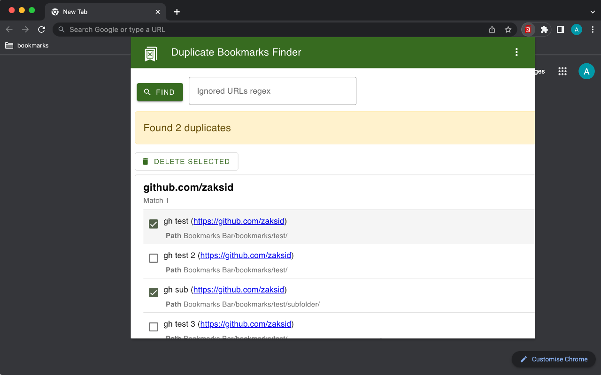
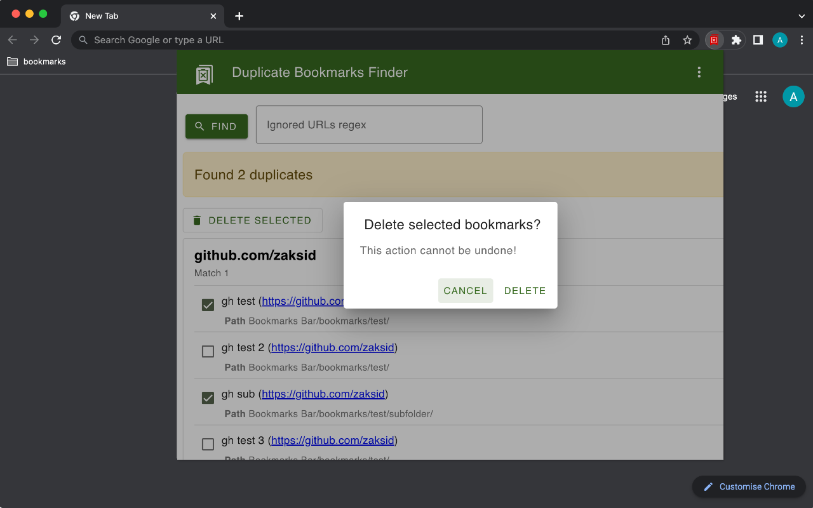
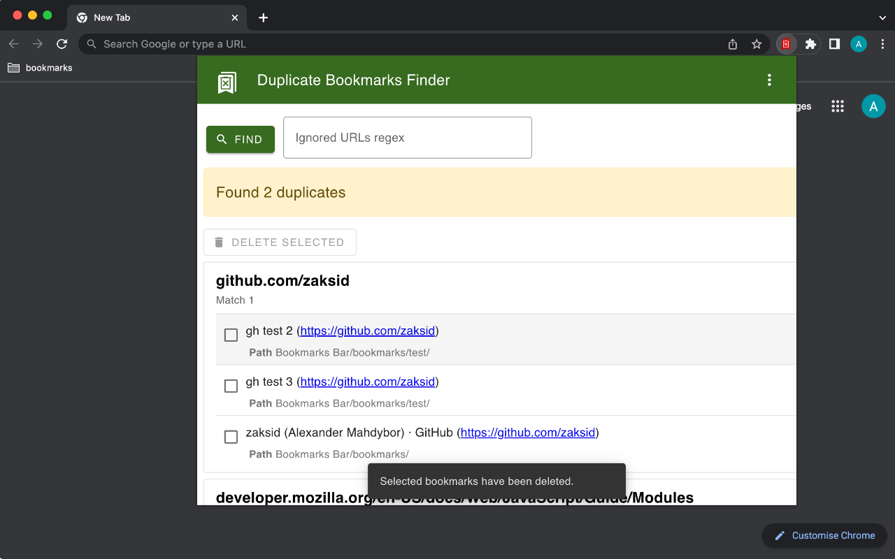

# Duplicate Bookmarks Finder

Find and delete duplicate bookmarks.

<p align="center">
    <a href="https://chrome.google.com/webstore/detail/duplicate-bookmarks-finde/mmfbmpbplefbggnhpiojnhcadkhglnlf">
        
    </a>
    <a href="https://addons.mozilla.org/addon/duplicate-bookmarks-finder/">
        
    </a>
</p>

This extension allows to find and delete duplicate bookmarks.

<p align="center">
    
    
    
    
</p>

## Developer section

### Dev dependencies

To install dev dependencies run:
```
npm i
```

Available npm scripts:
- `lint:js` - run eslint on project.
- `lint:css` - run stylelint on project.

### Updating extension version

To update extension version in all places where it's contained (manifests, README...), run
```
bash set-version.sh -v X.Y.Z
```

### Packing extension for store

To prepare zip archive for publishing in browser app store, run
```
bash pack.sh
```
Options:
* `-p` - platform - Platform to build for. If `firefox` is specified - build for Firefox publishing. Otherwise - for Chromium.
* `-m` - mode - Packing mode. If `dev` is specified - development mode.Create only build folder, don't zip. Otherwise mode=publishing (create zip, remove build folder).

### Recommended workflow
1. Make changes.
2. Run `bash set-version.sh -v X.Y.Z`.
3. Commit changes.
4. Update version in `package.json` + run `npm i`.
5. Run `npm run version`.
6. Commit `package.json`, `package-lock.json` and `CHANGELOG.md` files.
7. Tag.
8. Push.

## Possible further enhancements

* [ ] Find -> new search/find again
* [ ] Rewrite with modules + Webpack?
* [ ] Sort by folder path
* [ ] Delete folder if empty after deletion duplicates
