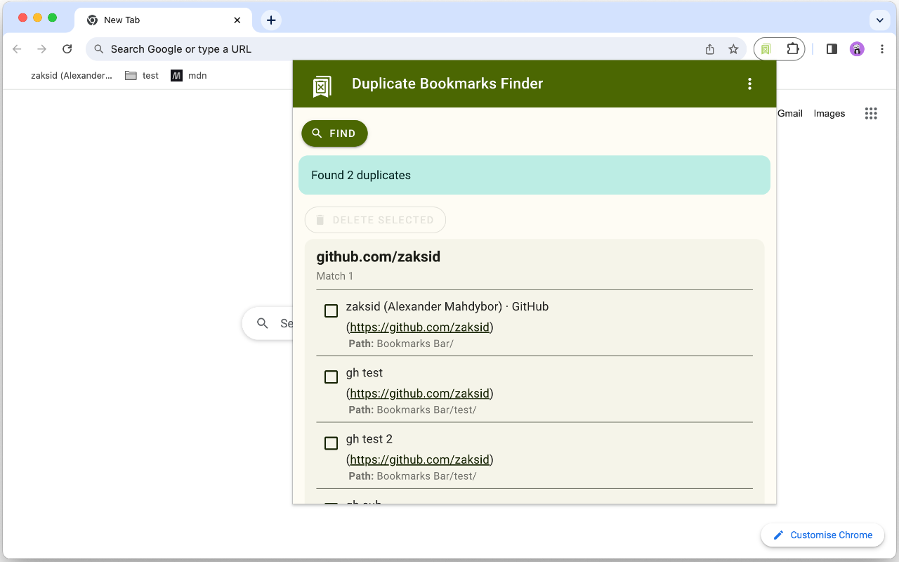
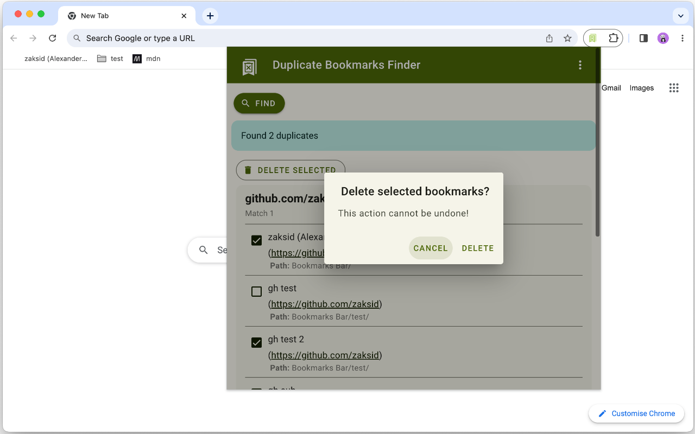
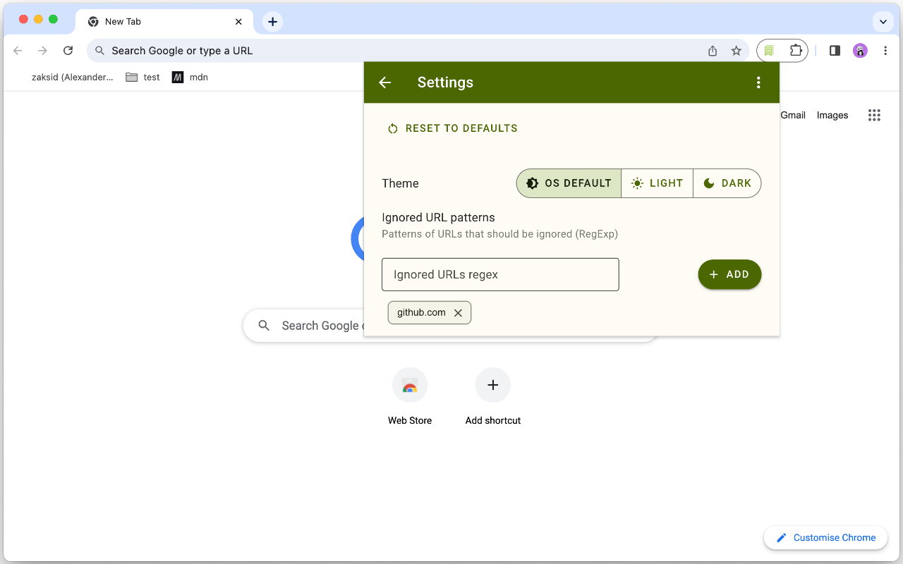
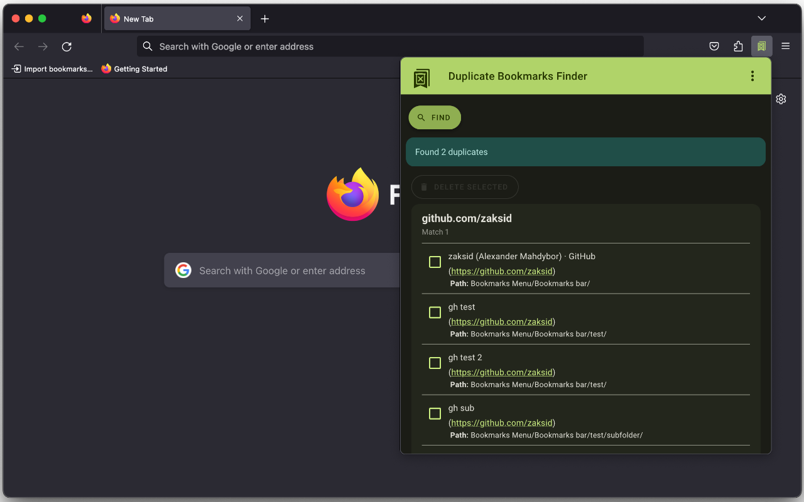
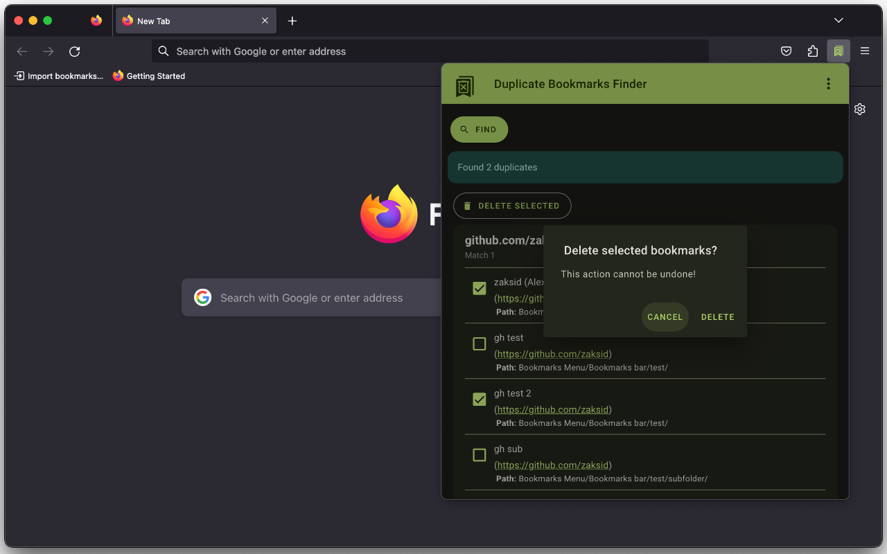
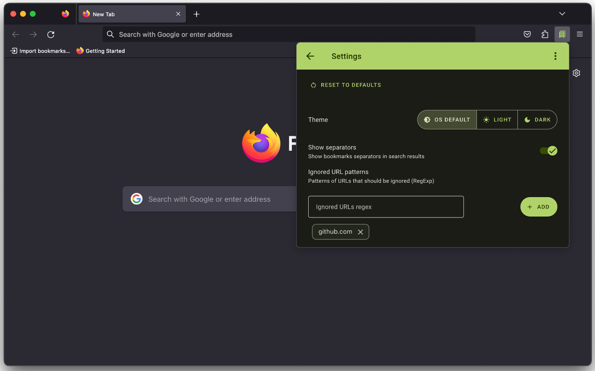

# Duplicate Bookmarks Finder


Find and delete duplicate bookmarks.

Available for the following browsers:

<p align="center">
    <a href="https://chrome.google.com/webstore/detail/duplicate-bookmarks-finde/mmfbmpbplefbggnhpiojnhcadkhglnlf">
        
    </a>
    <a href="https://addons.mozilla.org/addon/duplicate-bookmarks-finder/">
        
    </a>
    <a href="https://microsoftedge.microsoft.com/addons/detail/hlhmdjbnfokogkfbdjefekgpbjggbmcl">
        
    </a>
    <a href="https://addons.opera.com/en/extensions/details/duplicate-bookmarks-finder/">
        
    </a>
</p>

This extension is a browser pop-up that allows to find and delete duplicate bookmarks.

### Features:
- List all duplicated bookmarks
- Delete selected duplicates
- Dark/Light mode
- Use RegEx to ignore particular URL patterns

<p align="center">
    
    
    
</p>

<p align="center">
    
    
    
</p>

---

## Developer section

### Dev dependencies

To install dev dependencies run:
```
npm i
```

Available npm scripts:
- `lint:js` - run eslint on project.
- `lint:css` - run stylelint on project.
- `lint` - lint both js and css.
- `sass` - start Sass watch task.

### Updating extension version

To update extension version in all places where it's contained (manifests, README...), run
```
bash set-version.sh -v X.Y.Z
```

### Packing extension for store

To prepare zip archive for publishing in browser app store, run
```
bash pack.sh
```
Options:
* `-p` - platform - Platform to build for. Possible values: `firefox`, `opera`. Default (param not provided) `chromium`.
* `-m` - mode - Packing mode. If `dev` is specified - development mode.Create only build folder, don't zip. Otherwise mode=publishing (create zip, remove build folder).

### Recommended workflow
1. Make changes.
    - Run `npm run sass` to start watch task to monitor scss changes.
2. Run `bash set-version.sh -v X.Y.Z`.
3. Commit changes.
4. Update version in `package.json` + run `npm i`.
5. Run `npm run version`.
6. Commit `package.json`, `package-lock.json` and `CHANGELOG.md` files.
7. Tag (`git tag vX.Y.Z`).
8. Push.

## Possible further enhancements

* [ ] Find -> new search/find again
* [ ] Rewrite with modules + Webpack?
* [ ] Sort by folder path
* [ ] Delete folder if empty after deletion duplicates
